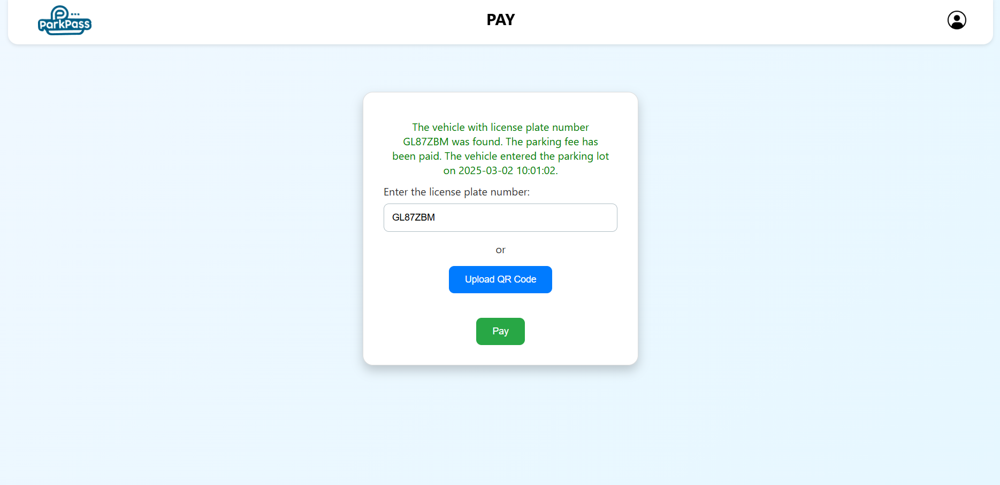
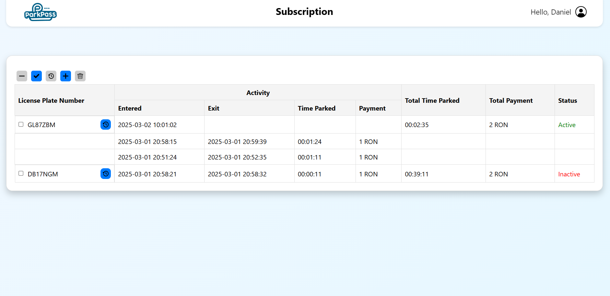

## About

The application, written in C++, aims to obtain information related to the entry and exit of vehicles in parking lots. Using various image processing techniques, the license plate number is identified in the image, segmented, rectified, read with the help of an AI model, and stored in database. A website was also implemented using Angular, which is hosted online and communicates in real-time with the desktop application and database, intended for users to pay parking fees and manage subscriptions. 

## Build Requirements

* C++ 17
* CMake 3.16.0
* PostgreSQL 13.0
* cpp-httplib 0.18.0
* POCO 1.5.1
* Boost 1.75.0
* nlohmann/json 3.10.0
* Qt 6.2.4
* OpenCV 4.5.0
* Tesseract 5.4.1
* libqrencode 4.1.1

## Installation

1. Install [CMake](https://cmake.org/download/) (at least version 3.16.0)
2. Install [PostgreSQL](https://www.postgresql.org/download/) (at least version 13.0)
3. Install [cpp-httplib](https://github.com/yhirose/cpp-httplib) (at least version 0.18.0)
4. Install [POCO](https://github.com/pocoproject/poco) (at least version 1.5.1)
5. Install [Boost](https://www.boost.org/users/download/) (at least version 1.75.0)
6. Install [nlohmann/json](https://github.com/nlohmann/json) (at least version 3.10.0)
7. Install [Qt](https://www.qt.io/download) (at least version 6.2.4)
8. Install [OpenCV](https://opencv.org/releases/) (at least version 4.5.0)
9. Install [Tesseract](https://tesseract-ocr.github.io/tessdoc/Compiling.html) (at least version 5.4.1)
10. Install [libqrencode](https://github.com/fukuchi/libqrencode) (at least version 4.1.1)
11. Clone this repository
12. Build the project by running the `build.bat` file
13. Run the project generated in the `build` folder (e.g. `build\ParkingLotsSecurity.sln` for Visual Studio)

## Website

The page for paying the parking fee. Users can make the payment either by entering the license plate number (if detected) or by uploading an image of the parking ticket to extract and decode the QR code.  
  

The subscription management page. The displayed subscription includes two vehicles, one of which is currently in the parking lot and has its history expanded for viewing.  
  

## Poster

