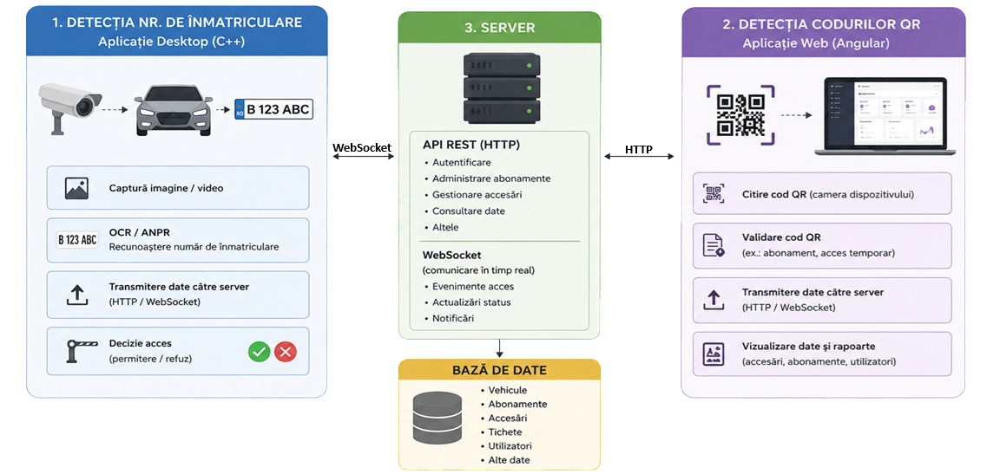
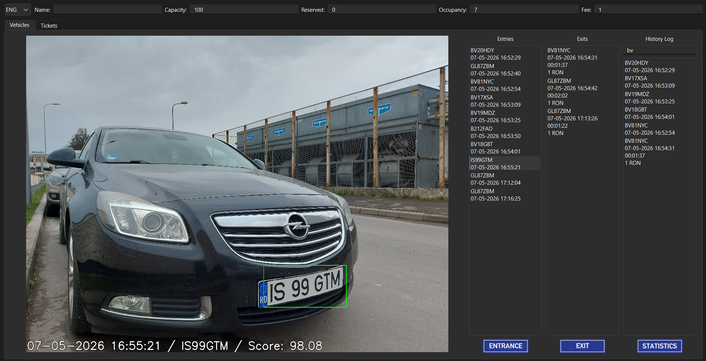
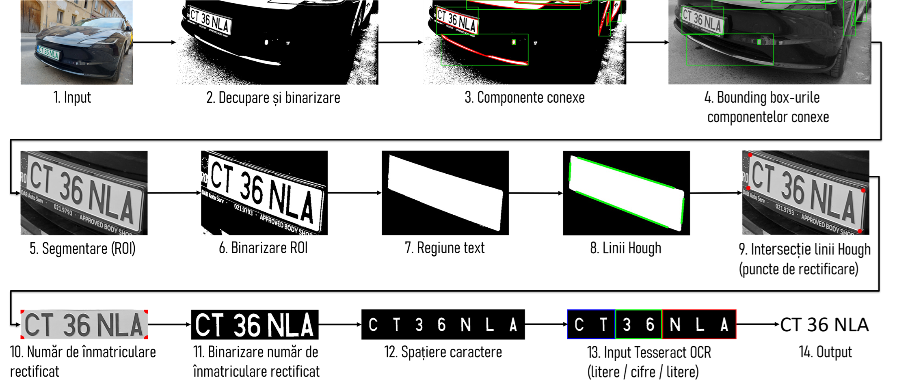
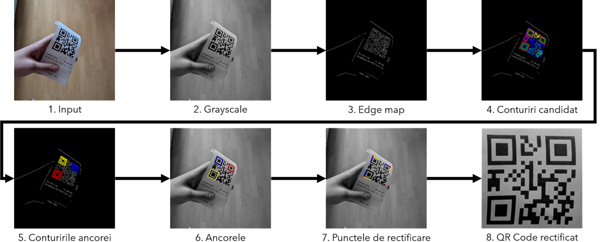
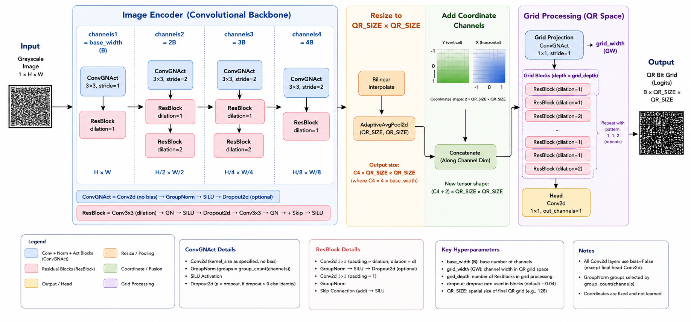
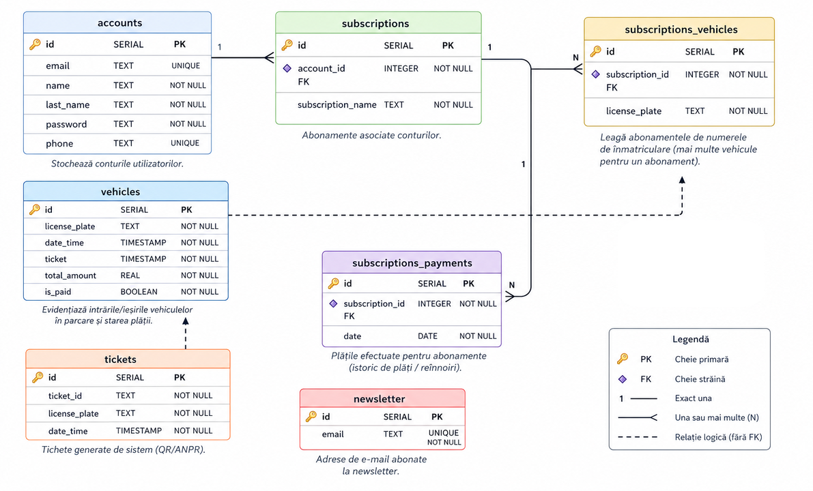

# Parking Lots Security

Parking Lots Security is a parking management system focused on **Computer Vision, Image Processing and Machine Learning**. The core of the project is represented by the automatic interpretation of visual data from parking lots: detecting and recognizing license plates from vehicle images, detecting QR codes from parking tickets images, and using a machine learning model to reconstruct and decode damaged or distorted QR codes.

Around these visual recognition pipelines, the project includes a local C++ desktop application, an Angular web application, a deployed server and a cloud-hosted database. The desktop application is used locally by the parking operator and communicates with the server in real time, sending vehicle and ticket information and receiving updates from the rest of the system. The website is deployed on a public domain and allows users to manage their accounts, vehicles, subscriptions and parking payments online.

## System Architecture

The project is organized around three main components:

1. **Desktop application** - a local C++/Qt application used in the parking lot for vehicle entry and exit management. It communicates with the server in real time and includes the computer vision pipeline for license plate detection and recognition.
2. **Web application** - an Angular website used by clients to manage accounts, subscriptions, vehicles and parking payments. It also includes the QR code identification pipeline and uses the AI model to decode the detected QR code for ticket validation.
3. **Server and database** - the deployed backend layer that connects the desktop application, the website and the database. It stores all the data and keeps the whole ecosystem synchronized. It exposes HTTP endpoints for the website and uses real-time communication for operational updates between the server and the desktop application.

## Desktop Application

The desktop application is the local component used by the parking operator. It allows the operator to process vehicle entries and exits, view detected license plates, manage tickets, check parking occupancy and access parking statistics.

The interface is built with Qt and is designed around the operational flow of a parking lot: loading vehicle images, detecting the license plate, validating the vehicle status and updating the parking records.

The application also includes a license plate recognition pipeline. The image is processed in multiple stages so the license plate can be detected, segmented, rectified and prepared for character recognition. The final result is used by the application to identify the vehicle and send the relevant information to the server.

## Web Application

The web application is the user-facing part of the system. It allows users to create accounts, log in, manage their profile, add vehicles, manage parking subscriptions and view parking history. It is developed in Angular and communicates with the server through HTTP requests.

The website is also connected to the QR-based ticket validation flow. QR codes are used as part of the parking payment and ticket validation process, allowing the system to identify and validate parking sessions when needed. For this step, the system uses an image processing pipeline that detects the QR code region, identifies its position in the image and rectifies it before decoding.

After the QR code is detected and rectified, a CNN-based model is used to reconstruct the QR matrix before the final decoding step. This makes the QR flow more robust when the input image is affected by perspective, blur, noise or imperfect lighting.

## Server and Database

The server is the central component that connects the entire ecosystem. It handles requests from the website, receives operational data from the desktop application, validates parking information, communicates with the database and encrypts exchanged messages.

The database stores the main system data, including accounts, vehicles, subscriptions, tickets, payments and parking history. Since the backend and database are deployed online, the desktop application and the website can share the same data source and remain synchronized.

Through this architecture, the system separates local parking operations from user-facing web features, while keeping all components connected through a centralized backend.
